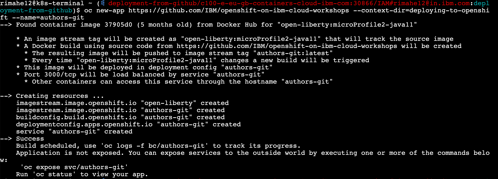
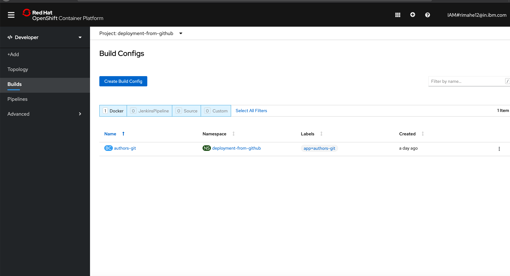
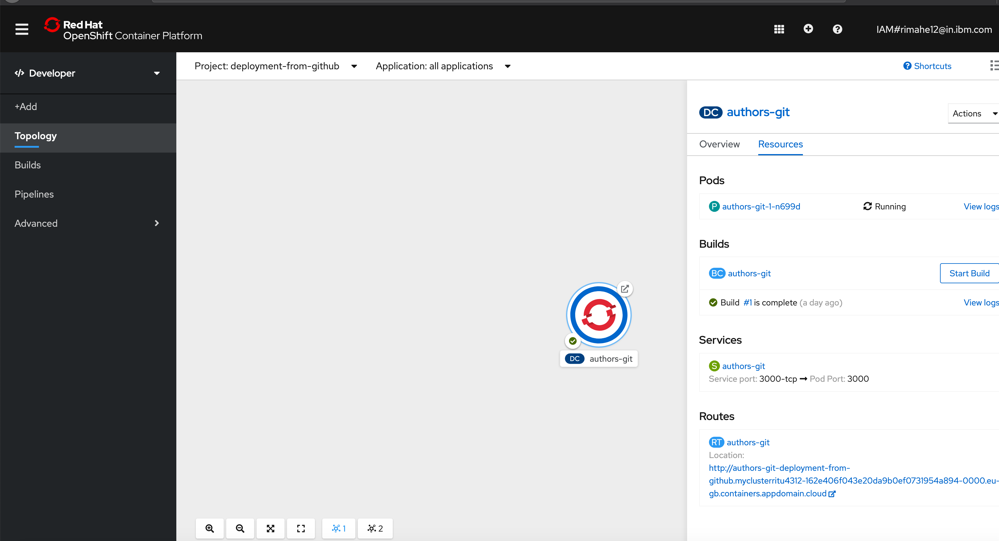

# Cloud Native App Deployment - Deployments of Code in GitHub Repos

## Overview

This lab shows how to deploy applications from Git repositories.

This deployment option checks whether a Dockerfile exist. With the Dockerfile a build on OpenShift is initiated. Since we use a Dockerfile with two stages, both the Java code is built as well as the Docker image.

Note that the yaml files are ignored with this approach.

Read the [documentation](https://docs.openshift.com/enterprise/3.0/dev_guide/new_app.html#specifying-source-code) for more details.

### Step 1

Create a new project 'deployment-from-github'.

```
$ oc new-project deployment-from-github
```

### Step 2

Create a new application and refer to a subdirectory in the GitHub repo.

```
$ oc new-app https://github.com/IBM/openshift-on-ibm-cloud-workshops --context-dir=deploying-to-openshift --name=authors-git
```

As result you'll get this output.

<kbd></kbd>

A build will be triggered and run on OpenShift. To verify the build on OpenShift, open the OpenShift Web Console as shown below.

<kbd></kbd>

From the list of projects, select your project

<kbd></kbd>

Navigate to the Builds from the left side of the OpenShift Web Console as shown below

<kbd></kbd>

You will be able to see the build triggered.

Click on the Project Details section to get the details

<kbd></kbd>

### Step 3

To verify your service is created:

Verify Service

```shell
oc get svc
```

You should see the followig output:

```shell
NAME               TYPE        CLUSTER-IP      EXTERNAL-IP   PORT(S)    AGE
authors-git        ClusterIP   172.21.142.205   <none>       3000/TCP   13m
```

### Step 4

In the last step create a route.

```
$ oc expose svc authors-git
$ oc get route
```

You should see the followig output:

```shell
NAME               HOST/PORT                                PATH      SERVICES           PORT      TERMINATION   WILDCARD
authors-git   authors-service-{project}.{subdomain}                  authors-git      3000-tcp                  None
```

To test the deployment, append '/openapi/ui' to the URL in the output of 'oc get route' and open it in a browser.

You can also access the Route from the Web Console as shown below

<kbd></kbd>

This is the deployed application with the route.

<kbd></kbd>

---
