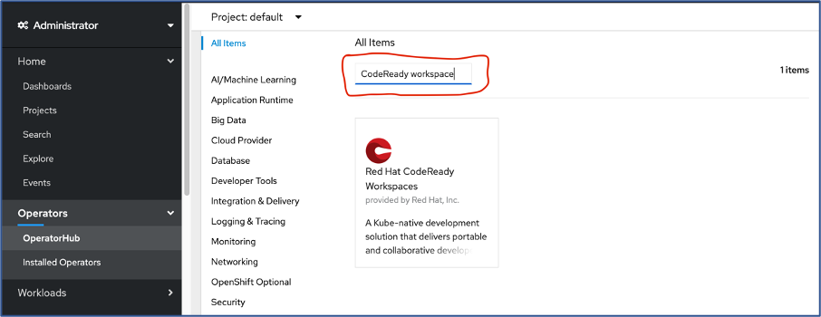
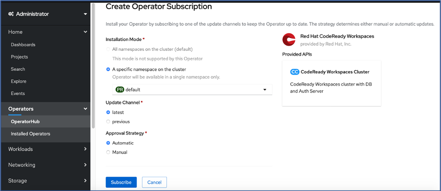

# Installation of Code-Ready Workspace in IBM Cloud OCP4.3 Cluster:

This documentation is focused to install and configure the Codeready workspace in the IBM Cloud OCP Cluster 4.3. The steps regarding the installation and configuration are detailed out as below:

### Step 1: Login to the IBM Cloud Environment.

### Step 2: Ensure you have provisioned the OCP4.3 Cluster in the  IBM Cloud.

### Step 3: Access the OCP Cluster that is provisioned. The Provisioned OCP Cluster Overview screen appears as below

### Step 4: Open the Openshift web console. It can be accessed by clicking the button that appears “Openshift web console” in blue at the top of OCP Cluster Overview Screen. Please refer to the image in step 3

# Installation of CodeReady workspace Operator:

### Step 5: The navigation will take you to the dashboard view of the OCP Console as below:

**Ensure you have the Administrator Permission to install the Code-Ready Operator. Highlighted as below**

### Step 6: Now Navigate to the Operators in the left Pane and then navigate to the operators Hub.

**Select the Project where you want to install the Codeready operator**

### Step 7: Search the Filter using “CodeReady Workspace”.  This filters to the Code Ready workspace Operator as shown below

### Step 8:Double click the Operator Filtered and this will navigate to the Installation User interface

### Step 9:Now Click on the Install button highlighted in Blue color. This will navigate to capture the environment information required for installing the operator.

**Re-confirm/Ensure the operator to be installed In the correct namespace/project**

### Step 9:Once confirming the parameters, Subscribe the Codeready workspace operator.

### Step 10:Once you scribe the operator shall get installed and appear as part of the “Installed Operators” in the Left Nav.

Congratulations! You have completed this workshop!
