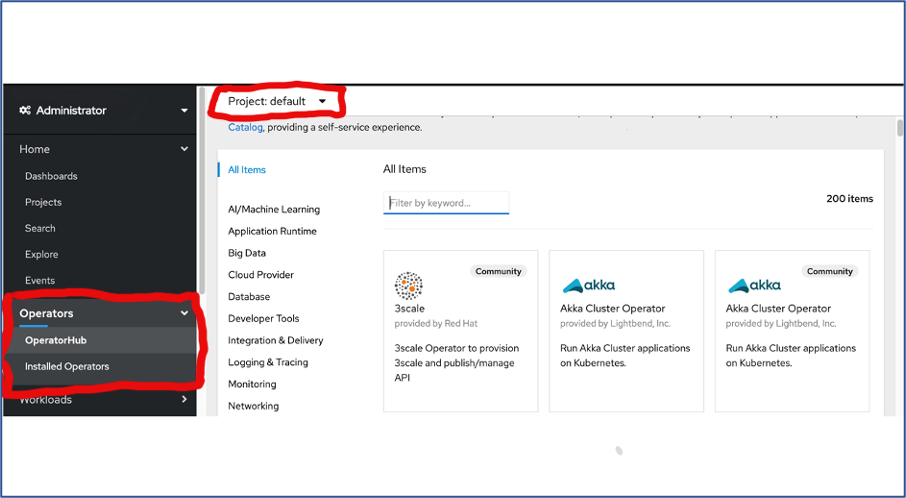
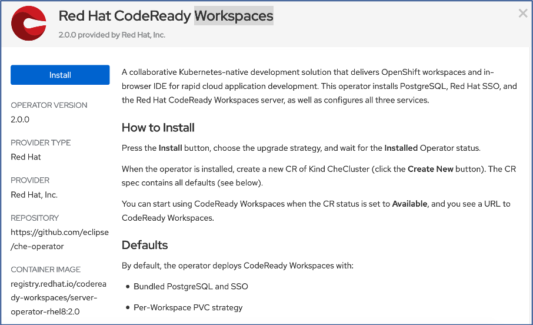
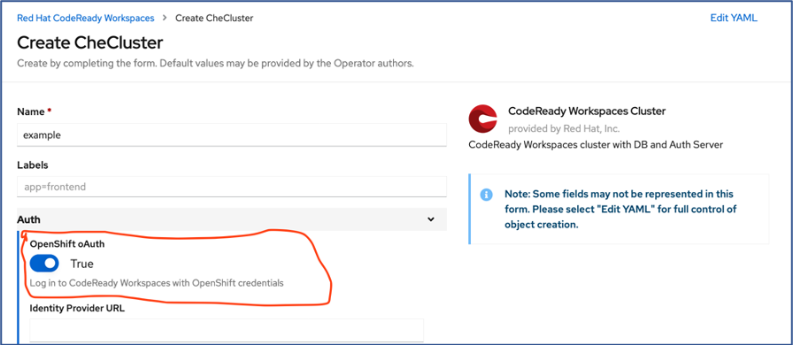

# Installation of Code-Ready Workspace in IBM Cloud OCP4.3 Cluster:

This documentation is focused to install and configure the Codeready workspace in the IBM Cloud OCP Cluster 4.3. The steps regarding the installation and configuration are detailed out as below:

### Step 1: Login to the IBM Cloud Environment.

### Step 2: Ensure you have provisioned the OCP4.3 Cluster in the  IBM Cloud.

### Step 3: Access the OCP Cluster that is provisioned. The Provisioned OCP Cluster Overview screen appears as below

### Step 4: Open the Openshift web console. It can be accessed by clicking the button that appears “Openshift web console” in blue at the top of OCP Cluster Overview Screen. Please refer to the image in step 3

# Installation of CodeReady workspace Operator:

### Step 5: The navigation will take you to the dashboard view of the OCP Console as below:

Ensure you have the Administrator Permission to install the Code-Ready Operator. Highlighted as below

### Step 6: Now Navigate to the Operators in the left Pane and then navigate to the operators Hub.

Select the Project where you want to install the Codeready operator

### Step 7: Search the Filter using “CodeReady Workspace”.  This filters to the Code Ready workspace Operator as shown below

### Step 8:Double click the Operator Filtered and this will navigate to the Installation User interface

### Step 9:Now Click on the Install button highlighted in Blue color. This will navigate to capture the environment information required for installing the operator.

Re-confirm/Ensure the operator to be installed In the correct namespace/project

### Step 9:Once confirming the parameters, Subscribe the Codeready workspace operator.

### Step 10:Once you scribe the operator shall get installed and appear as part of the “Installed Operators” in the Left Nav.

# Installation of Code Ready workspace Che-Cluster:

Once the Code-Ready Workspace operator is installed, the next step is to install the Codeready workspace cluster which is referred as “che-cluster”

## Step 11: Wait until the Code ready workspace operator is successfully installed as in step 10.  Once it is successfully installed click the link “CodeReady workspace Cluster”.

## Step 12: The page will navigate to the “CheCluster” page with list of clusters that is already installed and have “Create CheCluster” Button highlighted in “blue”.

Please note, at very first time, the page will have only “Create CheCluster” Button with no list as there is no cluster configured yet.

## Step 13: On the click of the Create CheCluster button, yaml configuration page shall open up. This shall enable the administrator to modify changes to configuration of the cluster by directly change the Yaml Configuration.

Otherwise,

The changes can also be done using the “Edit Form” link in the top left of the page

Please note, Yaml Edit will give full control of the Object Creation. The form may not represent all the properties supported by YAML

As part of this installation, the following changes to be done before creating the Cluster. Admin can choose either ways by directly updating the Yaml or through the “EditForm” Link

Initially the cluster can be setup without an SSO provided through oAuth (Log in to CodeReady Workspaces with OpenShift credentials).

Please note oAuth of Openshit is one of the ways for SSO. Alternatively, External Identify Provider can also be configured for the SSO.

1. By default, the Openshift oAuth parameter is true.

