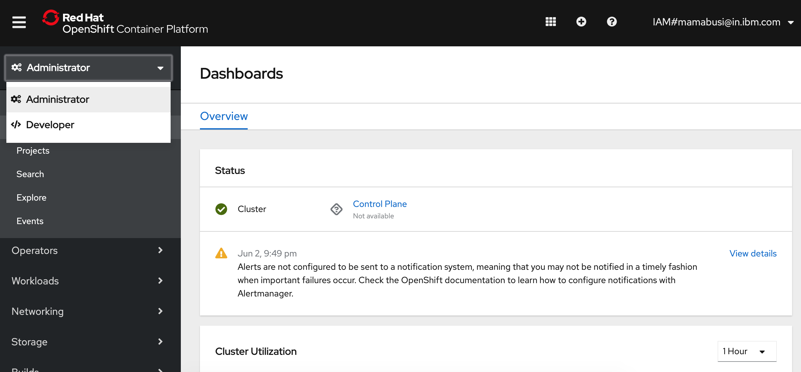
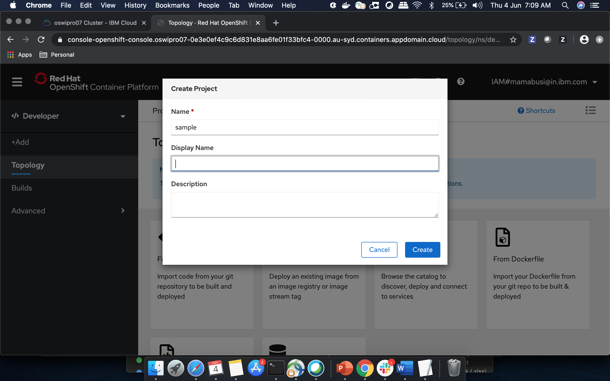
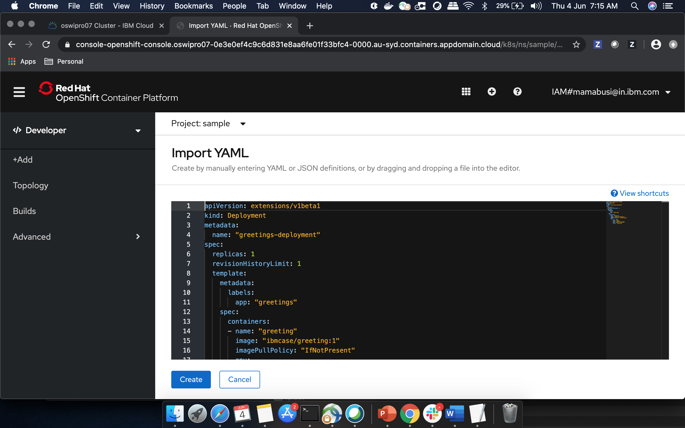

## Prerequisites

- Read and understand resource groups: [IBM Cloud Resource Groups](https://cloud.ibm.com/docs/resources?topic=resources-rgs)
- You will need an IBM Account for [IBM Cloud](https://cloud.ibm.com/)
- Downloaded and installed the OpenShift CLI at [OpenShift CLI Installation](https://OpenShift.io/docs/tasks/tools/install-kubectl/). Follow the instructions for your computer’s operating system.
- Downloaded and installed the IBM Cloud CLI at [IBM Cloud CLI Installation](https://cloud.ibm.com/docs/cli?topic=cloud-cli-getting-started#step1-install-idt). Follow the instructions for your computer’s operating system.

## IBM Cloud Login

Start by opening a web browser and navigating to [IBM Cloud](https://cloud.ibm.com/).


Next **_login_** with your IBM Cloud login you created. After login you will be navigated to your **Cloud Dashboard**.


On the **Cloud Dashboard** in the resource summary section, select **OpenShift Clusters**.


In cluster list, select the cluster you would like to access. Make sure the cluster you select has a red circle OpenShift icon next to it.

## Accessing the OpenShift Cluster

Once on the **Overview** screen of your OpenShift cluster, select the **Connect via CLI** in the upper right hand corner.


From this screen there are two options. One is using the **OpenShift Console** and the other is to use the **CLI via the oauth token request page** Once logged in to either the **OpenShift Console** or **CLI** we need to get the sample application.

## Getting the Sample Application

Download the sample application from Github: [Sample App](https://github.com/IBMDevConnect/cloudpakforappsbadge/tree/master/Lab%20-%20Openshift%20-%20Getting%20Started/cloudnativesampleapp)

## Deploying the Sample Application

In this section we will deploy the sample application that you downloaded. You can follow the **Console** section to deploy it via the **OpenShift Console** and the **CLI** section for the command line.

### Deploy Kubernetes App using OpenShift Console

With the OpenShift Console open, let’s **Create a Project** named **sample**

Switch to Developer Portal of the Web Console:



#### Create Project

In the Project dropdown, _click_ on **Create Project**


Next, fill in the name section with **sample** and _click_ **Create**



You will see that the project switched to your project (sample).

It’s time to add the **deployment** and **service**.

#### Create Deployment & Service

In **Finder** or **File Explorer** navigate to the **chart/cloudnativesampleapp** directory of the sample application.

Once there you will see two files: **deployment.yaml** and **service.yaml**

Move back to the OpenShift console and click on **+Add** in the upper-left corner. _Click_ it and select **YAML** tile.


Next an import screen will open and we need to pull up the **Finder** or **File Explorer** window with the **deployment.yaml** and **service.yaml** files.

_Drag and Drop_ the **deployment.yaml** file first.



_Click_ **Create** and you will see a new **greetings** deployment in the console.


For **Creating a Service** we are going to repeat the steps of **importing a YAML** just like a deployment, but instead of the **deployment.yaml** we will _Drag and Drop_ the **service.yaml**.


_Click_ **Create** 
You can see your new service named **greeting-service**.


#### Create a Route

Now we need to **Create a Route** for our new service to be reach by users outside of the cluster.

On the Project details page (navigate from the options on the left), scroll down to find the **Inventory** section and _click_ on **Route**.


This will open a form for **Creating a Route**. Fill in the required details and _Click_ **Create**.


A new route has now been created allowing us to access it from the internet. You can see the **Route’s Hostname**. That’s the new address for your service and we want to _Copy_ it


Next, _Open a New Tab_ in your web browser and _paste_ the copied address in the search bar. **BEFORE pressing enter** append **/greeting?name=John** to the end of the address. Then _Press Enter_

You should see the following:


Congrats! That’s you have successfully deployed an application on OpenShift.

### Deploy Kubernetes App using oc CLI

Next open up a **Terminal** window and follow the steps from the **Accessing the OpenShift Cluster** for the CLI access. (Make sure to append "--sso" after "login" if needed).

Create A Project

Once logged in, we want to create a new project called deploy-sample in your OpenShift Cluster:

```shell
oc new-project deploy-sample
```

If you already have an existing project, you can select the project using:

oc project deploy-sample

Get the Sample Application from Github

Get the code from the Github repository, and use the branch **Basic-Tutorial**

```shell
git clone -b "Basic-Tutorial" https://github.com/ibm-cloud-architecture/cloudnative_sample_app
```

Navigate to the **chart/cloudnativesampleapp** directory of the sample application.

```shell
cd chart/cloudnativesampleapp
```

Once there you will see two files: **deployment.yaml** and **service.yaml**

Create A Deployment

After we have created the project we need to create a deployment of our application.

In next few steps we will deploy each of them. We will start with creating the deployment:

```shell
oc create -f deployment.yaml
```

To verify your deployment is created:

Verify Deployment

```shell
oc get deployment
```

You should see the followig output:

```shell
NAME                   DESIRED   CURRENT   UP-TO-DATE   AVAILABLE   AGE
greetings-deployment   1         1         1            1           36s
```

Next, we will create the service:

Create A Service

```shell
oc create -f service.yaml
```

To verify your service is created:

Verify Service

```shell
oc get svc
```

You should see the followig output:

```shell
NAME               TYPE        CLUSTER-IP      EXTERNAL-IP   PORT(S)    AGE
greeting-service   ClusterIP   172.21.203.25   <none>        8080/TCP   16s
```

With everything deployed, we next need to expose the service outside the cluster. To do this we need to **create a route**

Create a Route

```shell
oc expose svc greeting-service
```

This creates a route connecting the application to users outside of the cluster. Now that we have a route created we can access the application from a web browser.

To get the created route run:

Retrieve the Route

```shell
oc get route
```

You should see the followig output:

```shell
NAME               HOST/PORT                                PATH      SERVICES           PORT      TERMINATION   WILDCARD
greeting-service   greeting-service-{project}.{subdomain}             greeting-service   http                    None
```

Find the route named **greeting-service** and copy the HOST/PORT. Should start with **greeting-service-deploy-sample**

Next Open a web browser and paste address in the search bar and append **/greeting?name=John** to the end of it and hit Enter. You should see the following:


Congrats! You have successfully deployed an application on OpenShift.

### Conclusion

You have successfully completed this lab! Let’s take a look at what you learned and did today:

- Logged into IBM Cloud
- Downloaded a Java Application from Github.
- Created a Deployment on OpenShift.
- Created a Service on OpenShift.
- Created a Route on OpenShift.
- Accessed an application through a web browser.


