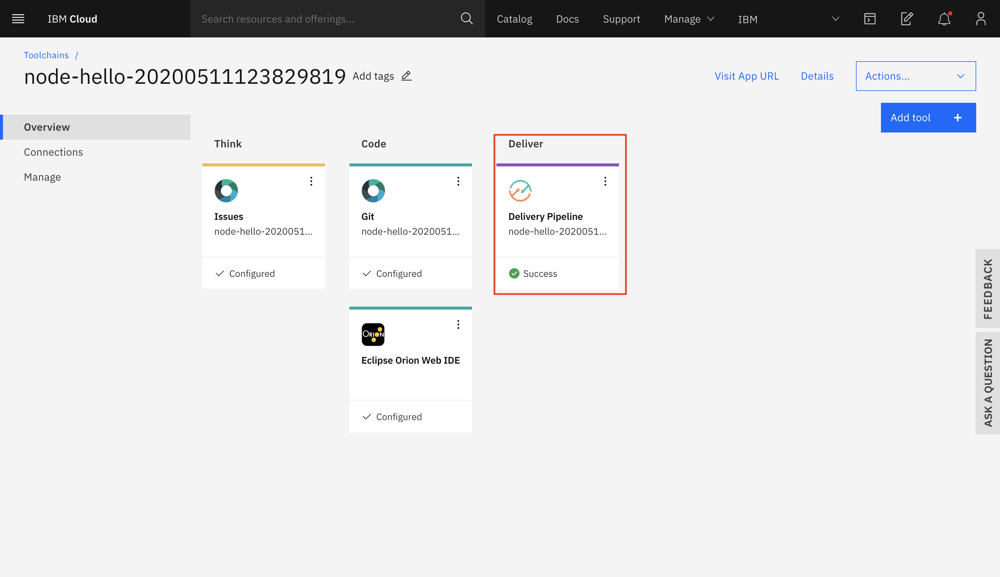

# Deploy simple Node.js application on IBM Cloud

### Pre-requisite: Create IBM Cloud Account [IBM Cloud](https://ibm.biz/BdqAuc). Please register with your Organization Email ID.

1. Press the above `Deploy to IBM Cloud` button and then...

   * Click `Create` section
   * Click on The `Delievery Pipeline` tab.
   * Click `New+` to create an IBM Cloud API Key.
   * Select your region, organization, and space (or use the defaults).
   * Click `Create`.

2. In Toolchains, click on `Delivery Pipeline` to watch while the app is deployed.

   

3. Click on `View Console` in the Deploy stage

   

4. Once deployed, the app can be viewed by clicking `Visit App URL`

   

5. You should be able to see "Hello World" as the output.
