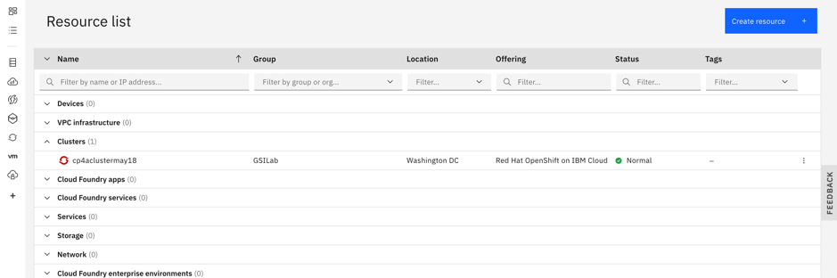
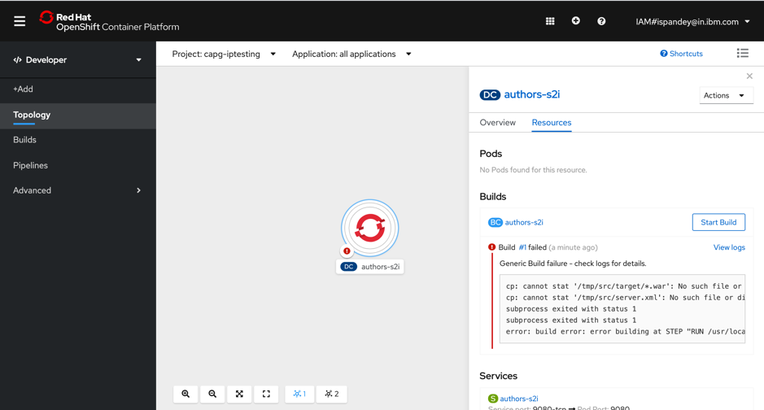

# Source to Image Deployments

## Overview

OpenShift allows developers to deploy applications without having to understand Docker and Kubernetes in depth. Similarily to the Cloud Foundry 'cf push' experience, developers can deploy applications easily via terminal commands and without having to build Docker images. In order to do this [Source-to-Image](https://github.com/openshift/source-to-image) is used.

Source-to-Image (S2I) is a toolkit for building reproducible container images from source code. S2I produces ready-to-run images by injecting source code into a container image.

In order to use S2I, builder images are needed. These builder images create the actual images with the applications. The builder images are similar to Cloud Foundry buildpacks.

# Prerequisties

 Total 3 pre-requisites-
 1) Get the Work Environment
 2) Get the code
 3) Get Access to OpenShift on the IBM Cloud
 
## Overview 

An [IBM Cloud account](https://cloud.ibm.com/registration) is needed. 

## Pre-requisite 1. Get the Work Environment
We will use the IBM Cloud Shell (Beta):

1. In your browser, login to the [IBM Cloud](https://cloud.ibm.com) Dashboard
2. Make sure you select **your own account** in the account list, then click on the IBM Cloud Shell Icon

   

    Note: Your workspace includes 500 MB of temporary storage. This session will close after an hour of inactivity. If you don't have any active sessions for an hour or you reach the 30-hour weekly usage limit, your workspace data is removed. To track your usage, go to Usage quota in the Cloud Shell menu.

   


## Pre-requisite 2. Get the code

In the IBM Cloud Shell execute the following commands:

```
$ git clone https://github.com/IshaniPandey/deploying-to-openshift.git
$ cd deploying-to-openshift
$ ROOT_FOLDER=$(pwd)
```

## Pre-requisite 3. Get Access to OpenShift on the IBM Cloud

NOTE: In case you have been provided a cluster link from the Developer Advocate for your session. Then you may skip this step mentioned in this lab and kindly follow steps mentioned during the session to get access to your specific cluster on the IBM Cloud.

### a. Open the OpenShift console. 

1. Go back to the IBM Cloud Dashboard (https://cloud.ibm.com).

2. Switch from your **own** account to the **IBM account** given to you by the instructor from the pulldown in the uper right corner.

3. Select **OpenShift -> Clusters** in the 'burger' menu

    

4. Click on your **OpenShift cluster**

    

5. Open the **OpenShift web console**

    

### b. Get the access token for the 'oc' CLI. 


1. From the dropdown menu in the upper right of the page, click 'Copy Login Command'. 

    

1. Click on 'Display Token', then copy and paste the command 'Log in with this token' into your terminal in the IBM Cloud Shell.

    

1. Login to OpenShift in IBM Cloud Shell

    ```
    oc login https://c1XX-XX-X.containers.cloud.ibm.com:XXXXX --token=xxxxxx'
    ```

    

---

Congratulations, you have completed your Pre-requisites for this lab. So now let us get started with the execution :

## Overview of the microservice used in this lab:

The microservice is kept as simple as possible so that it can be used as a starting point for other microservices. The microservice has been developed with Jakarta EE and [Eclipse MicroProfile](https://microprofile.io/). It is part of our [Cloud Native Starter](https://github.com/IBM/cloud-native-starter) project which basically consists of 3 microservices:


The web application Web-App (frontend) requests data from Web-API. Web-API retreives a list of articles (title and authors name) from the Articles service, and for every author it retrieves details (Blog URL and Twitter handle) from the Authors service. In this lab we only use the Authors service.

This would be the frontend:


## 1. Import of the Open Liberty Builder Image

OpenShift provides several builder images out of the box, for example for Node.js and Wildfly applications. In order to support other runtimes, for example Open Liberty, custom builder images can be built and deployed. Since this workshop uses Open Liberty, we will use a [builder image for Open Liberty](https://github.com/nheidloff/s2i-open-liberty) which needs to be imported before the actual Open Liberty microservice can be deployed.


We need an OpenShift project, this is simply put equivalent to a Kubernetes namespace plus OpenShift security. You will be using this project throughout the whole workshop.  The easiest way is to use your own name in the form `yourfistname-yourlastname`

```
cd ${ROOT_FOLDER}/deploying-to-openshift
oc new-project <yourfistname-yourlastname>
```

```
oc project
```
The user should be using the project created just now.

Add the Open Liberty builder image to the OpenShift internal image registry:

```
$ oc import-image docker.io/nheidloff/s2i-open-liberty:latest --confirm
```

Result:

```
imagestream.image.openshift.io/s2i-open-liberty imported

Name:                   s2i-open-liberty
Namespace:              capg-iptesting
Created:                Less than a second ago
Labels:                 <none>
Annotations:            openshift.io/image.dockerRepositoryCheck=2020-05-27T18:46:28Z
Image Repository:       image-registry.openshift-image-registry.svc:5000/capg-iptesting/s2i-open-liberty
Image Lookup:           local=false
Unique Images:          1
Tags:                   1

latest
  tagged from docker.io/nheidloff/s2i-open-liberty:latest

  * docker.io/nheidloff/s2i-open-liberty@sha256:b9959c8ba775255e48015a119a49ba8aa60c344779d4fe2f65a6310a3231bd89
      Less than a second ago

[...]
 ```     

In the OpenShift Web Console, in your own project, go to 'Builds' and 'Image Streams' and check that the 's2i-open-liberty' image is present:


The other images if appearing are the result of your previous deployments.

## 2. Deployment of the Microservice

The previous steps to install the Open Liberty builder image only have to be executed once. After this multiple Open Liberty applications can be deployed without Dockerfiles and yaml files.

### Step 1

The image builder expects a certain directory structure of Open Liberty projects with three files:

* server.xml in the root directory created 
* pom.xml in the root directory
* *.war file in the target directory

Before the code can be pushed to OpenShift, the 'war' file (Java web archive with microservice) needs to be built with Maven. Note: Maven is installed in the IBM Cloud Shell. If you are not using Cloud Shell you need to have `mvn` installed on your laptop.

```
cd ${ROOT_FOLDER}/deploying-to-openshift
mvn package
```

After you've run these commands, the file 'authors.war' will exist  in the 'target' directory, you can check with `ll target`.

```
ll target
total 36
drwxrwxr-x 7 ispandey user 4096 May 27 18:58 ./
drwxrwxr-x 7 ispandey user 4096 May 27 18:57 ../
drwxrwxr-x 4 ispandey user 4096 May 27 18:58 authors/
-rw-rw-r-- 1 ispandey user 5693 May 27 18:58 authors.war
drwxrwxr-x 3 ispandey user 4096 May 27 18:58 classes/
drwxrwxr-x 3 ispandey user 4096 May 27 18:58 generated-sources/
drwxrwxr-x 2 ispandey user 4096 May 27 18:58 maven-archiver/
drwxrwxr-x 3 ispandey user 4096 May 27 18:58 maven-status/
```


### Step 2

Next we create a new OpenShift application (our microservice) in your project.

The first parameter of the `oc new-build` command may look strange: 
the first part (s2i-open-liberty:latest) specifies the Open Liberty builder image, then comes a separator ('~'), then the specification of the local repository '/.' which contains the server.xml and authors.war needed for the build.

```
oc new-app s2i-open-liberty:latest~/. --name=authors-s2i
```

After executing these commands you should see this:


### Step 3

If you look in the OpenShift Web Console now, you will see that the build failed -- which is to be expected:



Before the microservice can be deployed with the image builder, the code (or more precisely 'authors.war' and 'server.xml') need to be uploaded to OpenShift. This is done via 'oc start-build'.

In the 'oc start-build' command we refer to the code of our Java microservice in the current directory.

Execute the following command in Cloud Shell:

```
$ oc start-build --from-dir . authors-s2i
```

After a moment you can see the successful build in the OpenShift Web Console.


Once the build (#2) is complete, a pod will be started and eventually be 'Running'.
It is not clear why the failed build is still showing, in OpenShift 3.11 it usually disappeared after a consecutive successful build. 

### Step 4

In the last step the route needs to be created as in the previous labs.

```
oc get pods
NAME                   READY   STATUS      RESTARTS   AGE
authors-s2i-1-build    0/1     Error       0          7m5s
authors-s2i-1-cnjg8    1/1     Running     0          3m1s
authors-s2i-1-deploy   0/1     Completed   0          3m3s
authors-s2i-2-build    0/1     Completed   0          3m38s
```

```
oc expose svc/authors-s2i
route.route.openshift.io/authors-s2i exposed
```

```
oc get route/authors-s2i
```
When the user clicks on the route , you shoudl be able to see the Open Liberty welcome page.


To test the deployment, append **'/openapi/ui'** to the URL in the output of 'oc get route/authors-s2i' and open it in a browser.


__Congratulation! You have completed this workshop!__
