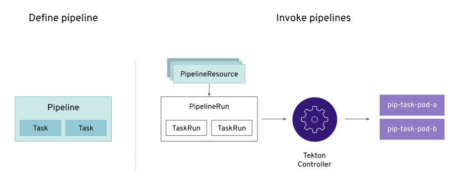

# OpenShift Pipelines Tutorial

Welcome to the OpenShift Pipelines tutorial!

OpenShift Pipelines is a cloud-native, continuous integration and delivery (CI/CD) solution for building pipelines using [Tekton](https://tekton.dev). Tekton is a flexible, Kubernetes-native, open-source CI/CD framework that enables automating deployments across multiple platforms (Kubernetes, serverless, VMs, etc) by abstracting away the underlying details.

OpenShift Pipelines features:
  * Standard CI/CD pipeline definition based on Tekton
  * Build images with Kubernetes tools such as S2I, Buildah, Buildpacks, Kaniko, etc
  * Deploy applications to multiple platforms such as Kubernetes, serverless and VMs
  * Easy to extend and integrate with existing tools
  * Scale pipelines on-demand
  * Portable across any Kubernetes platform
  * Designed for microservices and decentralized teams
  * Integrated with the OpenShift Developer Console

This tutorial walks you through pipeline concepts and how to create and run a simple pipeline for building and deploying a containerized app on OpenShift, and in this tutorial, we will use `Triggers` to handle a real GitHub webhook request to kickoff a PipelineRun.

In this tutorial you will:
* [Learn about Tekton concepts](#concepts)
* [Install OpenShift Pipelines](#install-openshift-pipelines)
* [Deploy a Sample Application](#deploy-sample-application)
* [Install Tasks](#install-tasks)
* [Create a Pipeline](#create-pipeline)
* [Trigger a Pipeline](#trigger-pipeline)

## Prerequisites

You need an OpenShift 4 cluster in order to complete this tutorial. If you don't have an existing cluster, go to http://try.openshift.com and register for free in order to get an OpenShift 4 cluster up and running on AWS within minutes.

You will also use the Tekton CLI (`tkn`) through out this tutorial. Download the Tekton CLI by following [instructions](https://github.com/tektoncd/cli#installing-tkn) available on the CLI GitHub repository.

## Concepts

Tekton defines a number of [Kubernetes custom resources](https://kubernetes.io/docs/concepts/extend-kubernetes/api-extension/custom-resources/) as building blocks in order to standardize pipeline concepts and provide a terminology that is consistent across CI/CD solutions. These custom resources are an extension of the Kubernetes API that let users create and interact with these objects using `kubectl` and other Kubernetes tools.

The custom resources needed to define a pipeline are listed below:
* `Task`: a reusable, loosely coupled number of steps that perform a specific task (e.g. building a container image)
* `Pipeline`: the definition of the pipeline and the `Tasks` that it should perform
* `PipelineResource`: inputs (e.g. git repository) and outputs (e.g. image registry) to and out of a pipeline or task
* `TaskRun`: the execution and result of running an instance of task
* `PipelineRun`: the execution and result of running an instance of pipeline, which includes a number of `TaskRuns`



In short, in order to create a pipeline, one does the following:
* Create custom or install [existing](https://github.com/tektoncd/catalog) reusable `Tasks`
* Create a `Pipeline` and `PipelineResources` to define your application's delivery pipeline
* Create a `PipelineRun` to instantiate and invoke the pipeline

For further details on pipeline concepts, refer to the [Tekton documentation](https://github.com/tektoncd/pipeline/tree/master/docs#learn-more) that provides an excellent guide for understanding various parameters and attributes available for defining pipelines.

The Tekton API enables functionality to be separated from configuration (e.g.
[Pipelines](https://github.com/tektoncd/pipeline/blob/master/docs/pipelines.md)
vs
[PipelineRuns](https://github.com/tektoncd/pipeline/blob/master/docs/pipelineruns.md))
such that steps can be reusable, but it does not provide a mechanism to generate
the resources (notably,
[PipelineRuns](https://github.com/tektoncd/pipeline/blob/master/docs/pipelineruns.md)
and
[PipelineResources](https://github.com/tektoncd/pipeline/blob/master/docs/resources.md#pipelineresources))
that encapsulate these configurations dynamically. Triggers extends the Tekton
architecture with the following CRDs:

- [`TriggerTemplate`](https://github.com/tektoncd/triggers/blob/master/docs/triggertemplates.md) - Templates resources to be
  created (e.g. Create PipelineResources and PipelineRun that uses them)
- [`TriggerBinding`](https://github.com/tektoncd/triggers/blob/master/docs/triggerbindings.md) - Validates events and extracts
  payload fields
- [`EventListener`](https://github.com/tektoncd/triggers/blob/master/docs/eventlisteners.md) - Connects `TriggerBindings` and
  `TriggerTemplates` into an
  [addressable](https://github.com/knative/eventing/blob/master/docs/spec/interfaces.md)
  endpoint (the event sink). It uses the extracted event parameters from each
  `TriggerBinding` (and any supplied static parameters) to create the resources
  specified in the corresponding `TriggerTemplate`. It also optionally allows an
  external service to pre-process the event payload via the `interceptor` field.
- [`ClusterTriggerBinding`](https://github.com/tektoncd/triggers/blob/master/docs/clustertriggerbindings.md) - A cluster-scoped
  TriggerBinding

Using `tektoncd/triggers` in conjunction with `tektoncd/pipeline` enables you to
easily create full-fledged CI/CD systems where the execution is defined
**entirely** through Kubernetes resources.

## Build and run Nodejs app on OpenShift using a cloud native Tekton Pipeline

### 1) Target your cluster

Log in to your IBM Cloud account and navigate to the overview page for your OpenShift cluster. Click on the OpenShift web console button in the upper right corner. On web console, click the menu in the upper right corner (the label contains your email address), and select Copy Login Command. Paste the command into your local console window. It should resemble the following example:

```
oc login https://c100-e.us-east.containers.cloud.
```

### 2) We are going to use a dedicated project to install the Tekton Operators in:

```bash
oc new-project tekton-pipelines --display-name='Tekton Pipelines'
oc adm policy add-scc-to-user anyuid -z tekton-pipelines-controller
oc apply --filename https://storage.googleapis.com/tekton-releases/latest/release.yaml
```
This creates two deployments in the tekton-pipelines project, named `tekton-pipelines-controller` and `tekton-pipelines-webhook`.

### 3) It is fast to start up, but to see if the pods are running, use the following oc command and wait for the ‘Running’ status:

```bash
oc get pods --namespace tekton-pipelines --watch
```
Use CTRL + C to exit watch mode.

### 4) Now that Tekton is running, we need to define a Task with steps saying what to do. 
We also need a TaskRun definition saying which Task to run. We need two yaml files for that. How the files are named does not really matter, but I am using the convention to end them with `-task.yaml` and `-task-run.yaml`
A Task definition file named `echo-hello-world-task.yaml`:

```bash
apiVersion: tekton.dev/v1alpha1
kind: Task
metadata:
  name: echo-hello-world-task
spec:
  steps:
    - name: echo
      image: ubuntu
      command:
        - echo
      args:
        - "hello world"
```

And a TaskRun definition file named `echo-hello-world-task-run.yaml`:
```bash
apiVersion: tekton.dev/v1alpha1
kind: TaskRun
metadata:
  name: echo-hello-world-task-run
spec:
  taskRef:
    name: echo-hello-world-task
 ```
 
 ### 5) We will apply the two files with the following commands:
 
 ```bash
oc apply -f echo-hello-world-task.yaml
oc apply -f echo-hello-world-task-run.yaml
```

### 6) As soon as both files are applied they will get directly executed. To follow the output of the TaskRun, use the command:

```bash
oc get taskruns/echo-hello-world-task-run -o yaml
```

### 7) Look through the output and search for:

```bash
status:
  conditions:
    - lastTransitionTime: 2019-07-08T18:48:15Z
      status: "True"
      type: Succeeded
   ```
